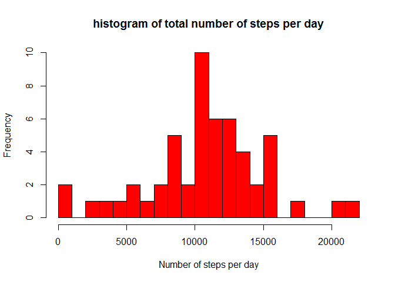
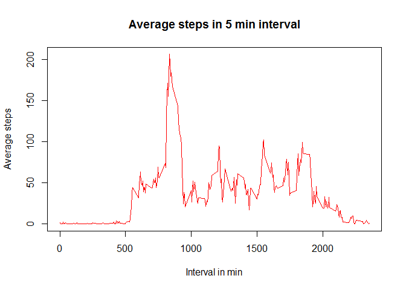
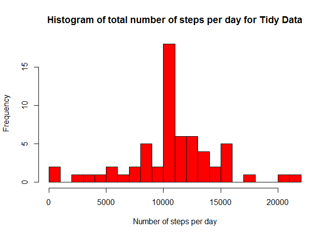
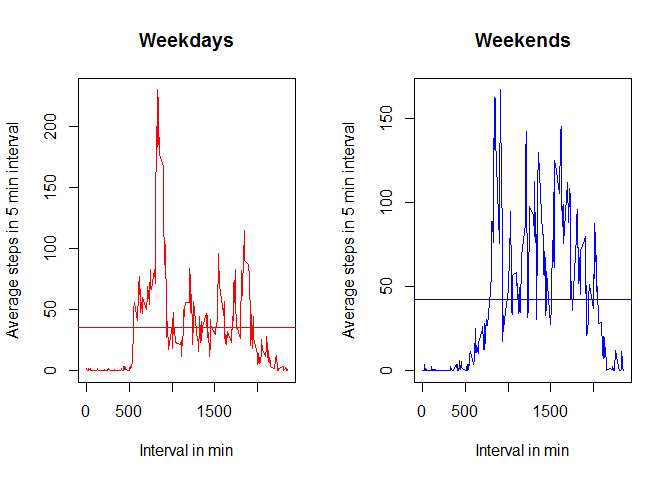

# Reproducible Research: Peer Assessment 1


## Loading and preprocessing the data
In this part the report shows the steps followed to load the activity monitoring data.

```r
unzip("activity.zip")
csvdat <- read.csv("activity.csv"
                   ,colClasses=c("numeric","Date","numeric"))
str(csvdat)
```

```
## 'data.frame':	17568 obs. of  3 variables:
##  $ steps   : num  NA NA NA NA NA NA NA NA NA NA ...
##  $ date    : Date, format: "2012-10-01" "2012-10-01" ...
##  $ interval: num  0 5 10 15 20 25 30 35 40 45 ...
```
## What is mean total number of steps taken per day?
In this part we calculate the mean of the total number of steps taken per day.   
* We first create a data model in which the total number of steps per day is calculated from the original data set.   
* We then use this data to plot a histogram of the total number of steps per day.  
* We then use the same data to calculate the mean and the median.


```r
stepsDay <- data.frame(steps = tapply(csvdat$steps, csvdat$date,sum))
hist(stepsDay$steps
     , main ="histogram of total number of steps per day"
     ,col='red'
     ,breaks = 20
     ,xlab = "Number of steps per day")
```

 

```r
mu <- mean(stepsDay$steps, na.rm=T)
mdn <- median(stepsDay$steps, na.rm=T)
```


The calculated mean is 1.0766189\times 10^{4} and the median is 1.0765\times 10^{4}


## What is the average daily activity pattern?

In this part of the report we create a time series that displays the average steps taken in a 5 min interval across all days. The created data frame is then plotted.


```r
minintervalAV <- data.frame(Steps=tapply(csvdat$steps,csvdat$interval,mean,na.rm=T)
                            ,Interval=unique(csvdat$interval))
summary(minintervalAV)
```

```
##      Steps            Interval     
##  Min.   :  0.000   Min.   :   0.0  
##  1st Qu.:  2.486   1st Qu.: 588.8  
##  Median : 34.113   Median :1177.5  
##  Mean   : 37.383   Mean   :1177.5  
##  3rd Qu.: 52.835   3rd Qu.:1766.2  
##  Max.   :206.170   Max.   :2355.0
```

```r
plot(
     minintervalAV$Interval
     ,minintervalAV$Steps
     ,type="l"
     ,col='red'
     ,main = "Average steps in 5 min interval"
     ,ylab = "Average steps"
     ,xlab = "Interval in min")
```

 

```r
mSteps <- max(minintervalAV$Steps)
intmSteps<- minintervalAV[ minintervalAV$Steps == mSteps , 2]
```
206.1698113 is the maximum number of steps  
835 is the interval at which the maximum occurs


## Imputing missing values

In this section the number of rows containing invalid data of NA values are calculated then the average value of the interval is substitued for the NA value to achieve a tidy data set.


```r
numMissingVal <- sum(is.na(csvdat))
fullData <- data.frame(steps = csvdat$steps ,date = csvdat$date, interval = csvdat$interval)
summary(fullData)
```

```
##      steps             date               interval     
##  Min.   :  0.00   Min.   :2012-10-01   Min.   :   0.0  
##  1st Qu.:  0.00   1st Qu.:2012-10-16   1st Qu.: 588.8  
##  Median :  0.00   Median :2012-10-31   Median :1177.5  
##  Mean   : 37.38   Mean   :2012-10-31   Mean   :1177.5  
##  3rd Qu.: 12.00   3rd Qu.:2012-11-15   3rd Qu.:1766.2  
##  Max.   :806.00   Max.   :2012-11-30   Max.   :2355.0  
##  NA's   :2304
```

```r
beforeProcess <- sum(is.na(fullData))
fullData$steps[which(is.na(fullData$steps))] <-
     minintervalAV$Steps 
    
afterProcess <- sum(is.na(fullData))
summary(fullData)
```

```
##      steps             date               interval     
##  Min.   :  0.00   Min.   :2012-10-01   Min.   :   0.0  
##  1st Qu.:  0.00   1st Qu.:2012-10-16   1st Qu.: 588.8  
##  Median :  0.00   Median :2012-10-31   Median :1177.5  
##  Mean   : 37.38   Mean   :2012-10-31   Mean   :1177.5  
##  3rd Qu.: 27.00   3rd Qu.:2012-11-15   3rd Qu.:1766.2  
##  Max.   :806.00   Max.   :2012-11-30   Max.   :2355.0
```

*  The total number of missing values in the data set is 2304 rows  
*  Number of NA values before processing is 2304  
*  The number after processing is 0   

Results above and summary of data before processing and after processing indicates that only fields of NA values were altered.

###Mean and Median for Total number of steps for tidy data

In this part we recalculate the mean of the total number of steps taken per day for the tidy data set.   


```r
fstepsDay <- data.frame(steps = tapply(fullData$steps, fullData$date,sum))
hist(fstepsDay$steps
     , main ="Histogram of total number of steps per day for Tidy Data"
     ,col='red'
     ,breaks = 20
     ,xlab = "Number of steps per day")
```

 

```r
fmu <- mean(fstepsDay$steps)
fmdn <- median(fstepsDay$steps)
```

The calculated mean is 1.0766189\times 10^{4} and the median is 1.0766189\times 10^{4}

###Mean & Median Comparison before and after Imputing missing values

Comparing the mean for the two data sets before and after no change took place. Median value slightly changed and shifted towards the mean.
comparing the two histograms we find that data is more concentrated around the mean, and histogram is smoother towards the ends.


## Are there differences in activity patterns between weekdays and weekends?

In this part a day field and a day type field are added to the data frame 


```r
fullData[,"day" ] <- sapply(c(fullData$date), weekdays)
fullData$day <-factor(fullData$day ,levels= 
    c("Monday","Tuesday","Wednesday","Thursday","Friday","Saturday","Sunday"))  
dayT <- function(n) {
    val <- as.character("weekday")
    if(n %in% c("Saturday","Sunday"))  {val <- as.character("weekend")  }
    val
    }
fullData[,"dayType"] <- sapply(fullData$day, dayT)

boxplot(fullData$steps ~ fullData$dayType ,data=fullData, col="red")                        
```

 
 
The boxplot shows that in weekdays the data are more concentrated towards the mean. 
